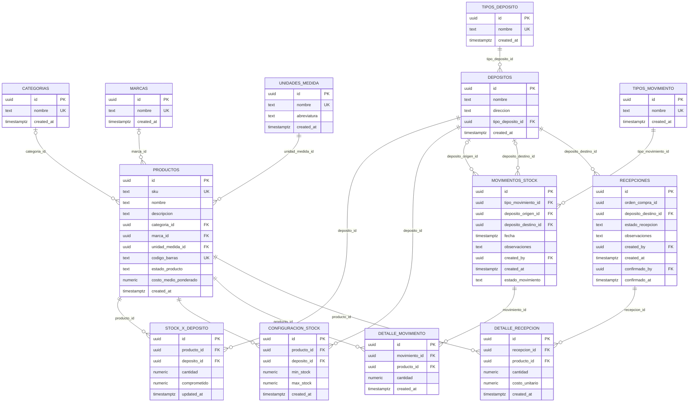

# DER del módulo Stock

---

Nota: `movimientos_stock.created_by` es una clave foránea hacia `auth.users(id)` del sistema Supabase Auth.

## Reglas y notas del modelo

- `stock_x_deposito.cantidad` representa el stock físico.
- `stock_x_deposito.comprometido` representa el stock reservado o comprometido.
- El stock disponible NO se almacena en la base; se calcula como `cantidad - comprometido`.
- `configuracion_stock` almacena el `min_stock` y `max_stock` por `producto` y `deposito`.
- `costo_medio_ponderado` pertenece a `productos` (por artículo), no a nivel depósito.
- `movimientos_stock` y `detalle_movimiento` son históricos e inmutables para usuarios `authenticated`.
- Para `authenticated` solamente existen permisos `SELECT` e `INSERT` sobre `movimientos_stock` y `detalle_movimiento`.
- No existen policies `UPDATE` ni `DELETE` para esas dos tablas.
- `recepciones` y `detalle_recepcion` siguen el mismo criterio: solo `SELECT`/`INSERT` para `authenticated`, y el paso de `pendiente` a `confirmada` ocurre únicamente dentro de la función `confirmar_recepcion` (`SECURITY DEFINER`).
- `recepciones.orden_compra_id` es un `uuid` sin foreign key: el módulo de Compras todavía no existe en este esquema.

## Unicidades importantes

- `categorias.nombre` UNIQUE
- `marcas.nombre` UNIQUE
- `unidades_medida.nombre` UNIQUE
- `tipos_deposito.nombre` UNIQUE
- `productos.sku` UNIQUE
- `productos.codigo_barras` UNIQUE
- `stock_x_deposito` UNIQUE(`producto_id`, `deposito_id`)
- `tipos_movimiento.nombre` UNIQUE
- `configuracion_stock` UNIQUE(`producto_id`, `deposito_id`)

---

Si detectás alguna inconsistencia de cardinalidad o querés que incluya tipos más detallados, lo ajusto.

## Versión gráfica

